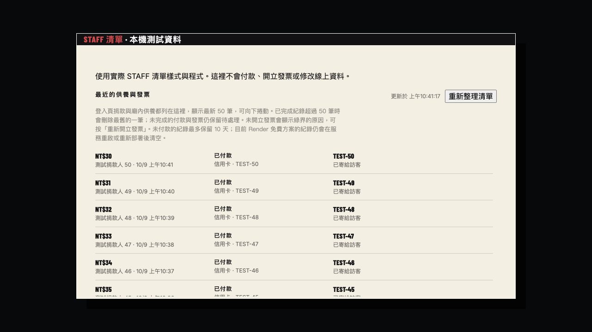
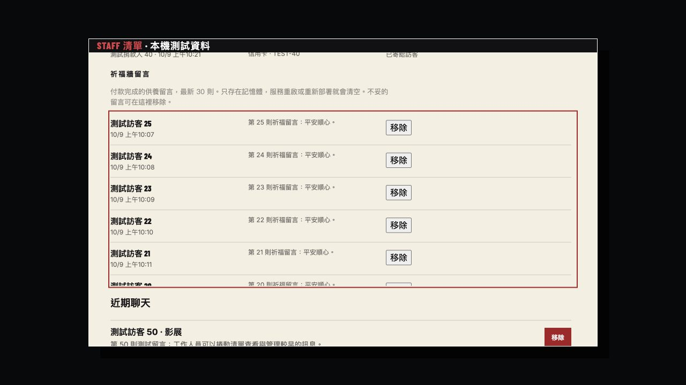
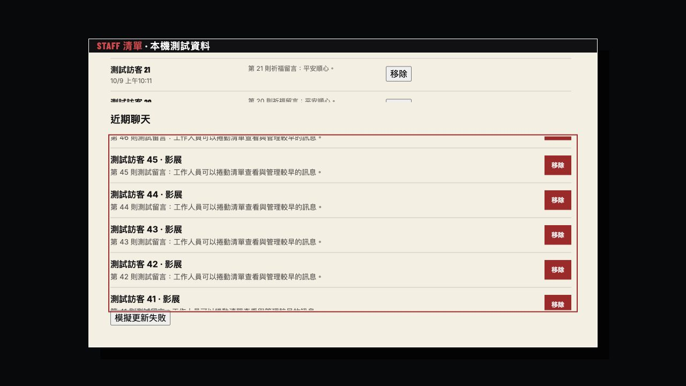

# STAFF history review — 2026-10-09

Local, unpublished changes. The browser screenshots below use synthetic records, not recovered production donations.

The sign-in donation was successfully paid, invoiced and emailed at 20:44 on October 8 according to Render's logs. Later fresh service instances started at 23:00, 23:16 and 23:31, and STAFF subsequently showed no records. Sign-in donations already use the shared history endpoint. The current Free service loses local filesystem changes across restarts: [Render documentation](https://render.com/docs/free#local-files-lost-on-redeploy). Durable storage is pending the owner's choice; the missing record has not been restored.

Completed history now retains its newest 50 records, removing the oldest completed records beyond that limit. STAFF shows at most 50 donation rows. Paid records awaiting invoices and in-flight processing are protected behind the display limit. Unpaid checkout retention stays ten days. Successful payment time controls ordering, so a deferred payment becomes a recent record when it settles.

Donations, wish-wall messages and chat each have an independently scrollable region. The local browser measured:

| List | Rows | Visible height | Content height | Verified scrollTop |
| --- | ---: | ---: | ---: | ---: |
| Donations | 50 | 324px | 2890px | 304px |
| Wish wall | 30 | 324px | 1824px | 304px |
| Chat | 50 | 324px | 3250px | 304px |

The real donation refresh method preserved scrollTop 304 and all 50 rows. A simulated fetch failure showed an error while retaining the rows and scroll position. Donation/help copy is available in Chinese and English. Keyboard focus outlines identify each scroll region.

Two new server HTTP tests exercise sessionless sign-in donation visibility, mocked signed payment/invoice/email, restart with a retained settings file, latest-50 count pruning and settlement of an older deferred checkout. All 391 tests and the production TypeScript/Vite build passed. No live ECPay requests, payment mutations, invoice retries or deployment were performed.

Local review: `http://127.0.0.1:5173/staff-history-review.html`. The fixture imports the actual App methods and styles and is not a production build entry.
