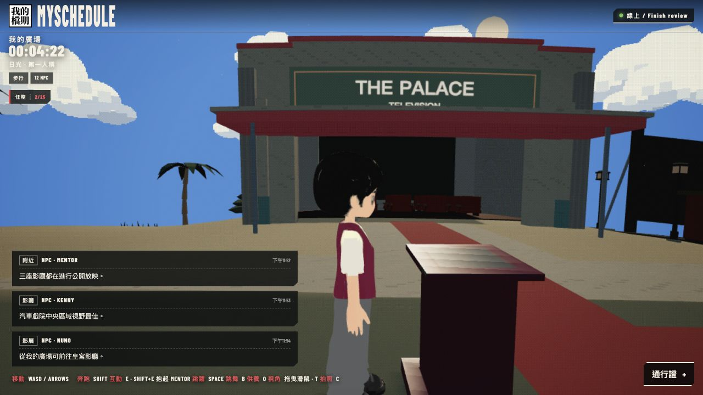
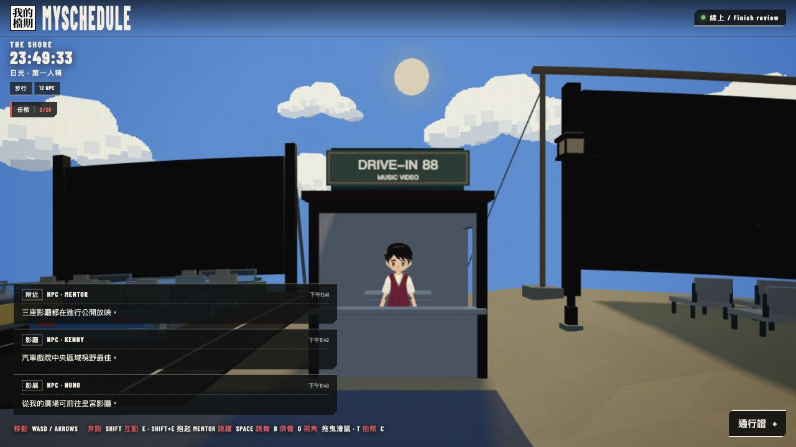
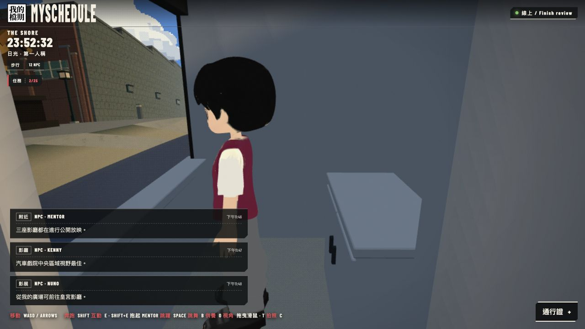
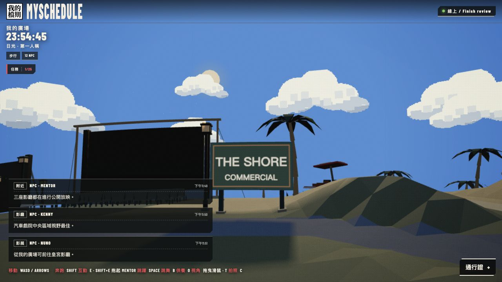
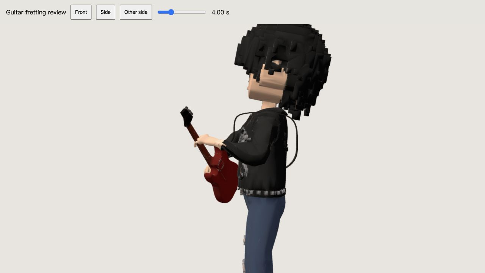
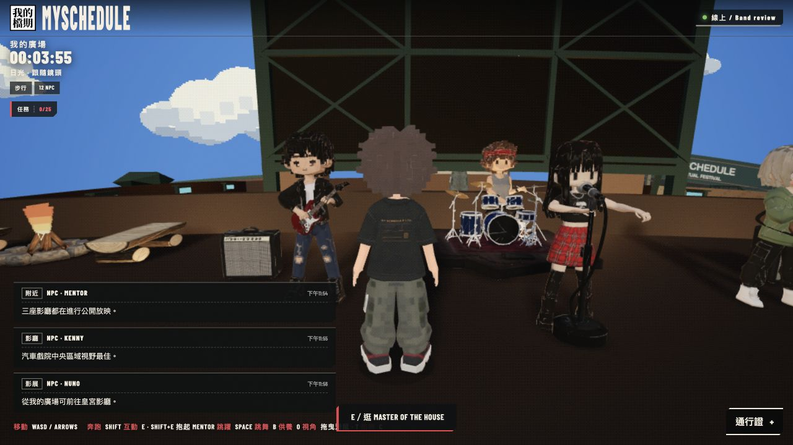

# Venue finish review — completed 2026-10-10

Local, unpublished. Owner acceptance remains pending.

The two attendants now have clean ivory sleeves and charcoal trousers. Their original generated character geometry, rig, face/hair/shoe maps and independent idle motion are preserved. The burgundy vest remains. Sleeve and trouser atlas patches were repaired with selective material assignments.

The booth retains the generated roof/sign. Its defective lower shell and cabinet were replaced with closed, lightly beveled plaster panels, posts and cabinet parts. This is a selective geometry repair, not a claim that the entire booth is the original download. Raw source backups and the updated provenance preserve that distinction.

The Shore sign moved forward from z=-20.5 to z=-16.1, ahead of its streetlamp and still clear of the road. Collider and approach coordinates follow the shared placement constants.

The guitarist's fretting fingers previously received extra curl after the contact solver. Removing that override restores contact on the neck. Only 12 fretting-finger play tracks changed in the installed model; other tracks, geometry and texture bytes remain intact. A test samples 64 phases of the full 16-second loop against the animated, skinned guitar mesh. The three pressing fingertips are within 5.44 mm of the neck in those samples.

All 398 tests and the standard TypeScript/Vite production build passed. Diff whitespace checks passed. Full-world desktop views verified these surfaces and the playing band. This does not claim physical-device testing or owner acceptance. Complete local preview: http://127.0.0.1:5173/?era=ps2&island . Nothing has been committed, published or deployed.
