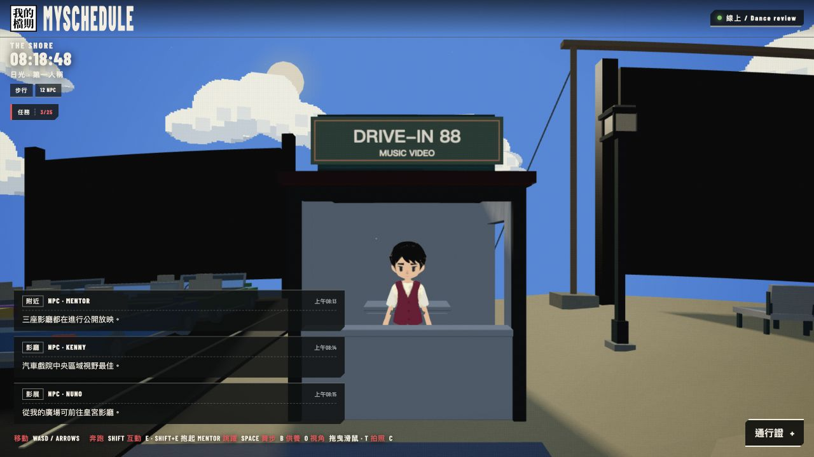
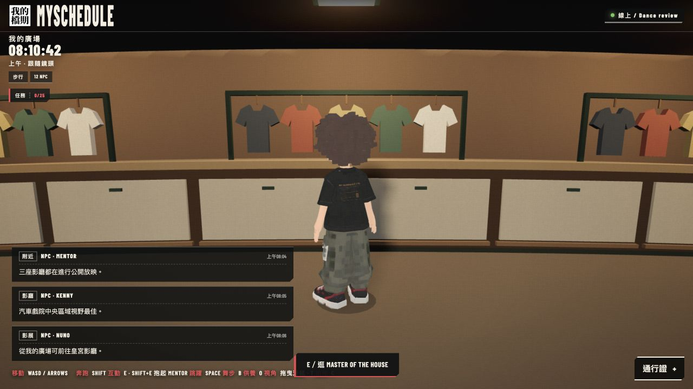
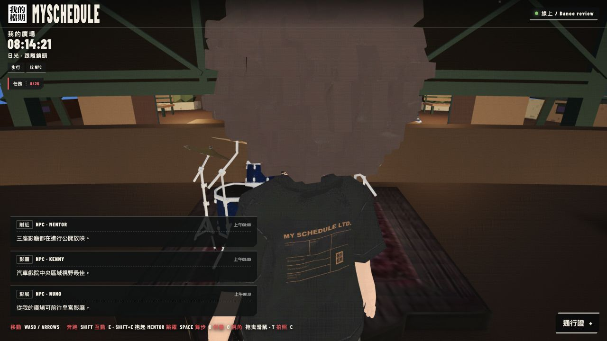
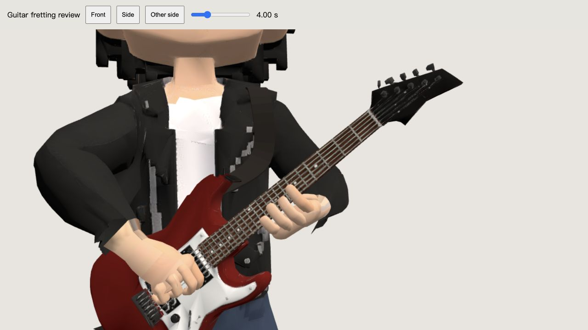
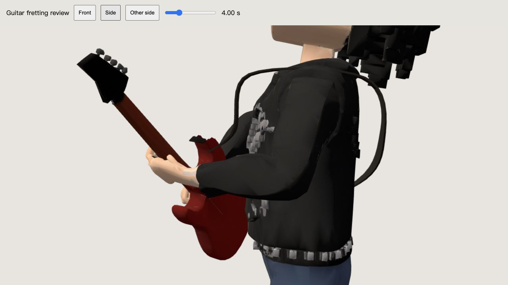
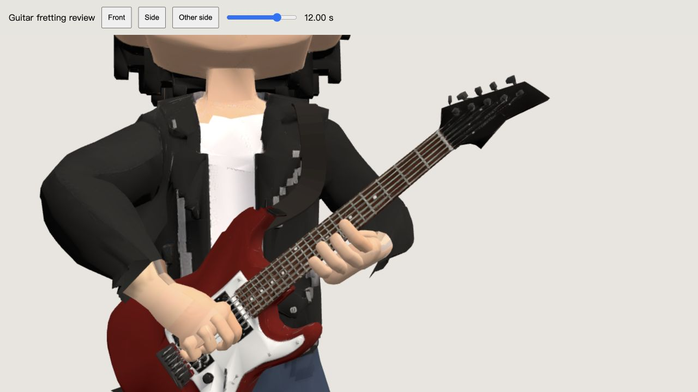
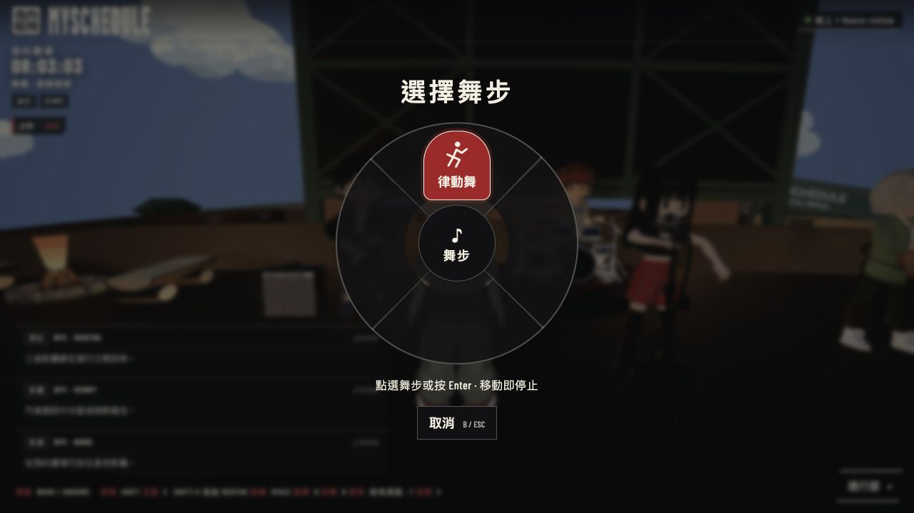

# Local follow-up review — 2026-10-10

Four requested changes are implemented locally. Nothing was published.

## Counter and clothing shop

The box-office counter fits between both front posts (actual model bounds checked). The shop's shared proximity predicate now includes height; roof avatars cannot display or activate its E prompt. Ground prompt remains; pressing E requests the existing popup, but the in-app browser blocks that popup.

## Fretting hand

Palm faces up beneath fretboard; forearm twist follows the hand rather than twisting only the wrist. Finger bends and wrist placement were checked using actual skinned vertices, not just bone endpoints. 64 sampled phases across the 16-second playing loop: 27,558 skin/envelope ray checks, zero inside the neck/string envelope, minimum clearance 5.13mm. Nearest index/middle/ring skin remains within 7.96mm of envelope. This measures sampled vertex clearance, not a continuous triangle intersection proof. Original geometry, maps, skin and other animation bytes preserved.

## Dance selection

B opens the radial selector without starting dance. Click/Enter starts GROOVE / 律動舞; B/Escape cancels. Reopen while dancing to Stop Dancing. Movement ends dance. Actual browser verified keyboard, pointer, cancellation and stop behavior. Touch and nonimmersive controller hooks share the selector; physical devices were not tested. Immersive headset controls retain their prior toggle.

## Verification

401 tests passed; TypeScript and Vite production build passed; whitespace check passed. Existing large bundle warning remains. Test/build logs are under `.artifacts/venue-followup-20261010/`. Owner visual acceptance remains pending. Use the complete local site at http://127.0.0.1:5173/?era=ps2&island or the guitar close-up at http://127.0.0.1:5173/band-hand-review.html?time=12&distance=1.1.
