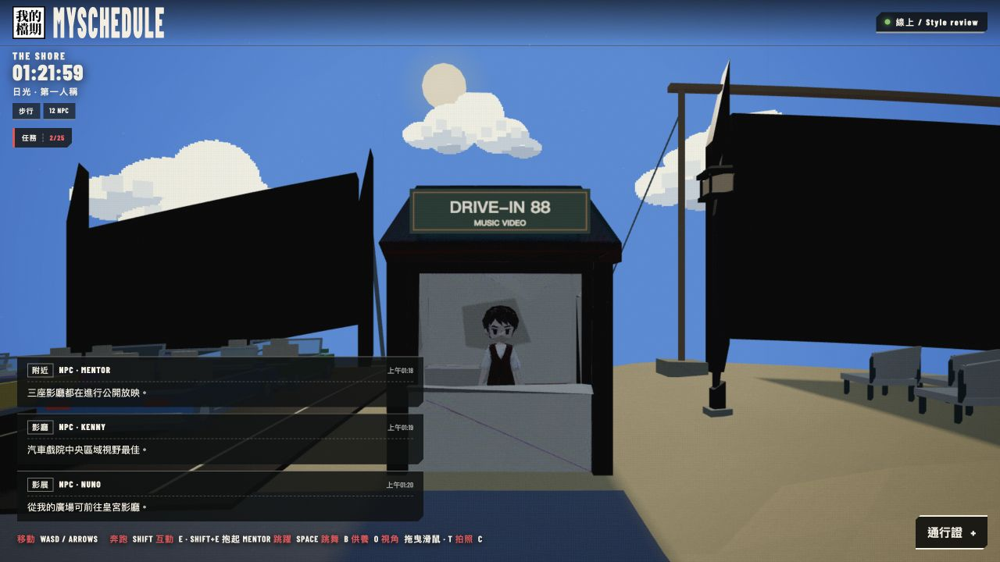
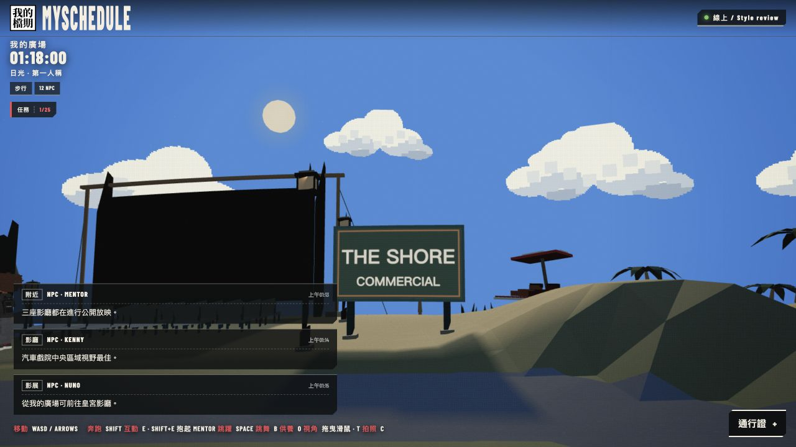
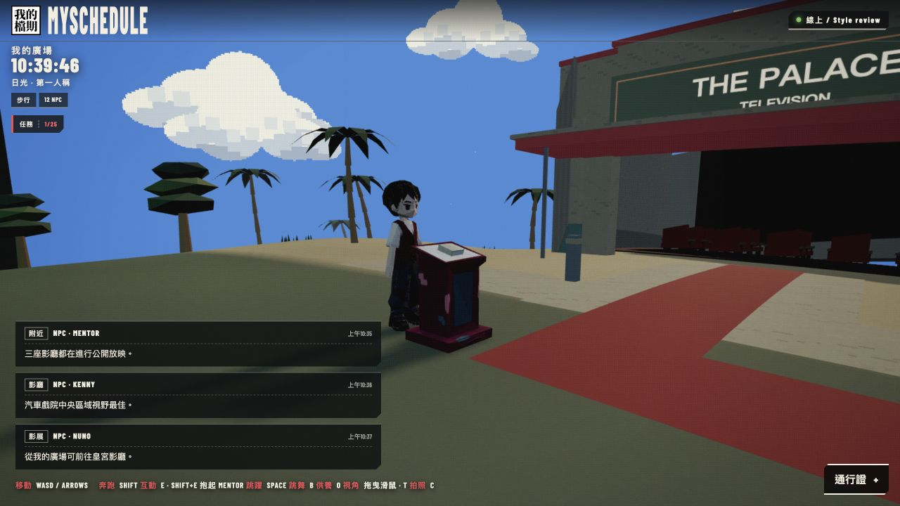
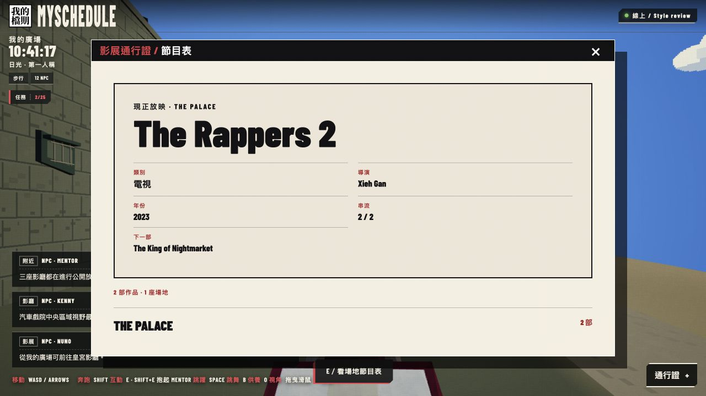
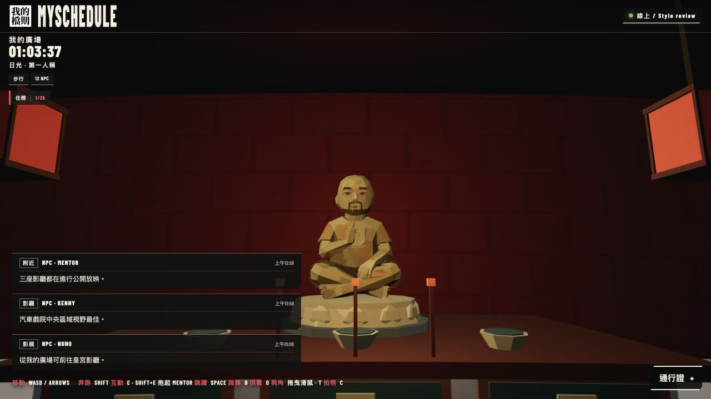

# Venue scenery visual review — 2026-10-09

**Historical first-pass review, superseded by the owner’s walkthrough rejection and [world repair review](WORLD_REPAIR_REVIEW_20261009.md). The compact asset sizes and quality claims below describe the rejected version, not the current originals.**

Local and unpublished. Regenerated through Higgsfield / Meshy 7 using the current avatar/world style references. All four generated models loaded in the actual world. The two unlisted attendants share one compact character design, with independent rigs and idle motion. The statue retains the supplied person's pose and facial features in matte gold.

## DRIVE-IN 88

Real service opening, side door, retained floor/ceiling and attendant. Nearby programme opens this venue's 32 works.

## THE SHORE

Off-road placement beside the venue, lettering clear of the lamp, feet fitted to the sloped terrain. Nearby programme opens this venue's four works.

## THE PALACE

Inspector and valet lectern rotated 90° counterclockwise and moved 1.2 units closer to the carpet, 2.2 inward toward the Palace, at (-37.6, -12.2). The inspector stands behind it at (-39, -12.2). Their rotated collision footprint remains outside the carpet. Nearby programme was rechecked at the new approach and opens this venue's two works. Staff remain absent from the attendee/NPC roster.

## Temple portrait statue

Bald head, beard, crossed legs, upright right palm and left hand on the lap, on the existing lotus dais. Offering interaction remains at the statue.

## Evidence and limitations

TypeScript/Vite build and all 391 tests passed, including five scenery tests. Tests inspect the actual generated geometry and skin weights, model budgets, independent cloned rigs, the service opening, proximity boundaries and road/carpet clearances. Front/side/back and world screenshots were visually inspected in the local desktop browser. Four prepared GLBs total 655,660 bytes; full source provenance is recorded in `VENUE_ASSET_PROVENANCE_20261009.json`.

Physical phone/headset behavior and owner acceptance of the redesigned appearance remain unverified. No publication or deployment occurred.
