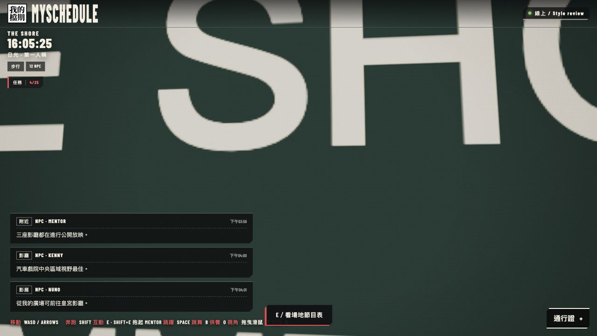
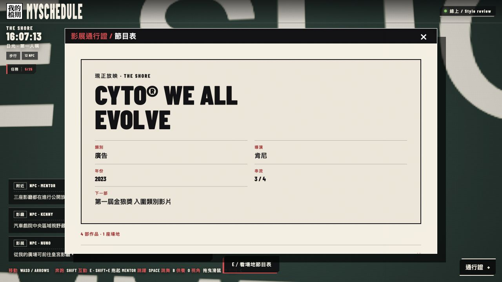
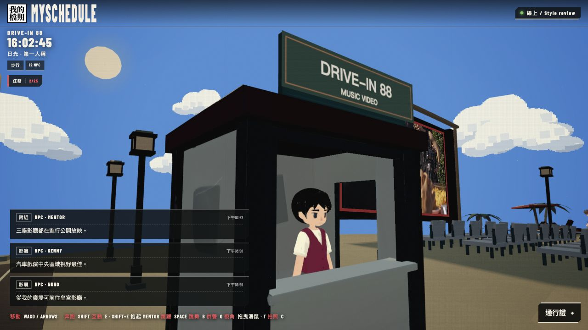
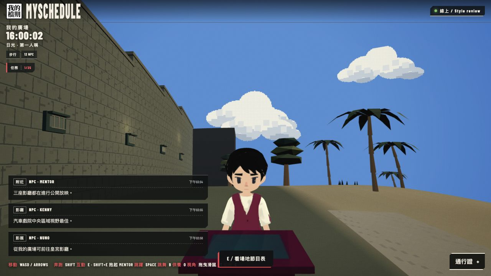
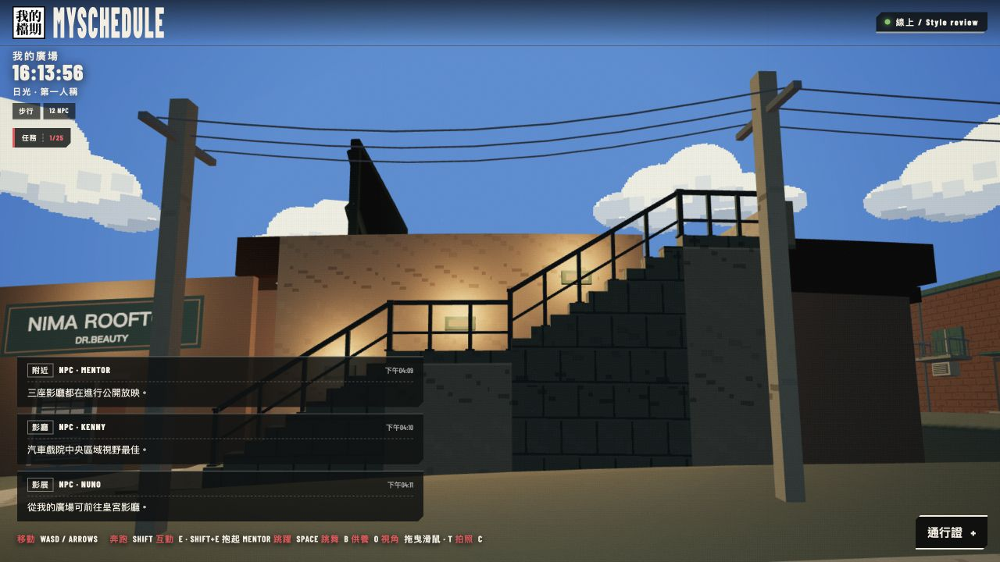
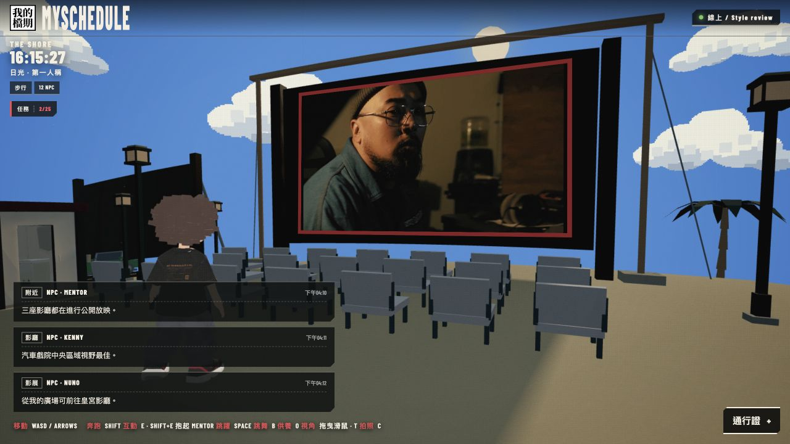
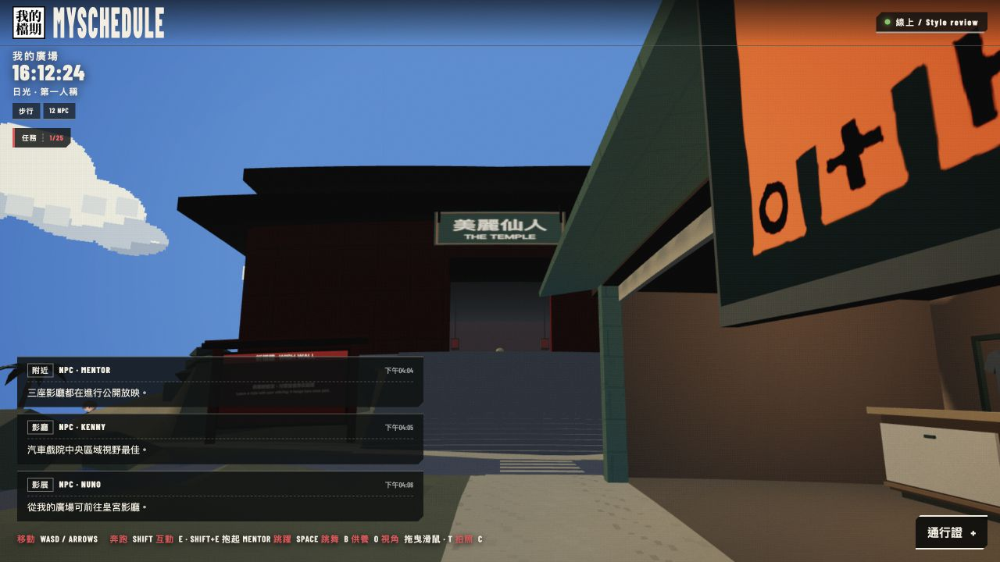
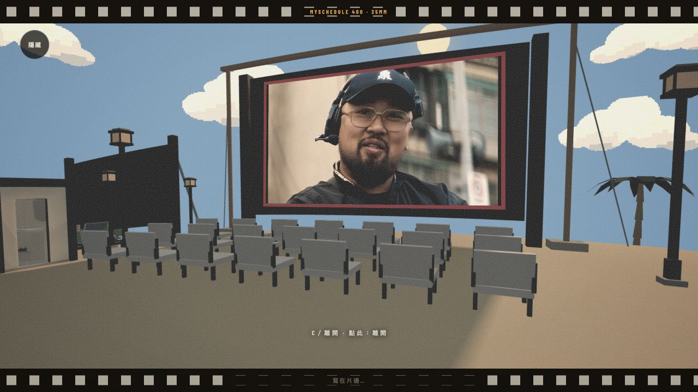
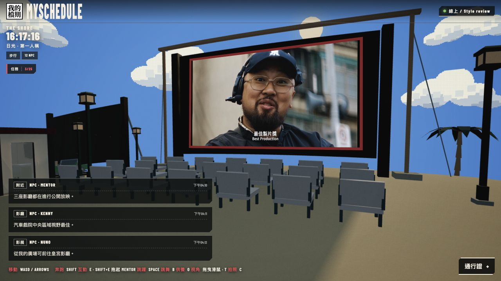

# World repairs after owner walkthrough — 2026-10-09

Follow-up: the owner subsequently identified source outfit, wall and cabinet defects. [The latest finish review](VENUE_FINISH_REVIEW_20261009.md) supersedes the byte-identical attendant/booth statements and Shore coordinates below. These two models now have selective local repairs recorded in provenance.

Local and unpublished. These checks supersede the earlier compact-scenery review. Owner appearance acceptance remains pending.

The distorted world came from directly changing the shared unit cube while fitting the new Shore feet. Each foot now owns its geometry. A real-world-builder regression verifies shared cube vertices and normals remain untouched and the bottom of each foot follows the actual terrain.

The Shore board/frame/posts, box office, Palace lectern and inspector now block whole avatar bodies. Actual browser movement: W for 3 seconds stopped at z=-19.48, before the board centred at z=-20.5. A further 2 seconds of Shift+W left the same position. E still opened the Shore programme from outside the collider.

Late-loaded models now join the foreground rendering layer. An active Shore screening stays behind opaque booth geometry and remains visible through the actual side doorway.

Meshy 7 regenerated the attendants, box office and lectern using the same accepted style direction, with enough geometry to preserve their edges. Installed files are the byte-identical original downloads, preserving 2K textures, normal maps and authored material surfaces. Models have 18,382, 11,821 and 6,696 triangles respectively; the original statue remains 935 triangles. Generated source provenance and checksums are in `VENUE_ASSET_PROVENANCE_20261009.json`. Four assets total approximately 20 MB; preserving the original maps increases download size versus the rejected compressed build.

Attendants use the existing player-avatar colour-lighting response, suppressing duplicated baked emission. A small skin-only warmth adjustment leaves ivory shirts, eyes, hair and uniforms unchanged. Geometry and source texture bytes are preserved. Both unlisted staff have independent skeletons and idle motions and remain outside the 12 named NPC roster.

Fresh browser views also inspected the temple shell, rooftop stair treads/stringer/rails, the Shore’s screen supports and the nearby Drive-In screen. The shared-cube spikes and floor/stair distortions were absent in these checked views.

C enters camera mode and returns directly to normal play from any photo mode. Visible controls still select postcard/film modes. Browser checked camera, postcard and film exits; text inputs still type C, and Escape is the exit while typing.

396 tests passed, including real scenery geometry/rig checks, service-window opening, footprint clearance, late foreground layers, source-file checksums, shared-geometry isolation and full-height collision movement. TypeScript/Vite production build and diff whitespace checks passed.

This is local desktop-browser evidence. No phone/headset testing, owner acceptance or public deployment is claimed. Refresh any preview that was open during the broken build; an already-mutated cube cannot be repaired by hot reload alone.
